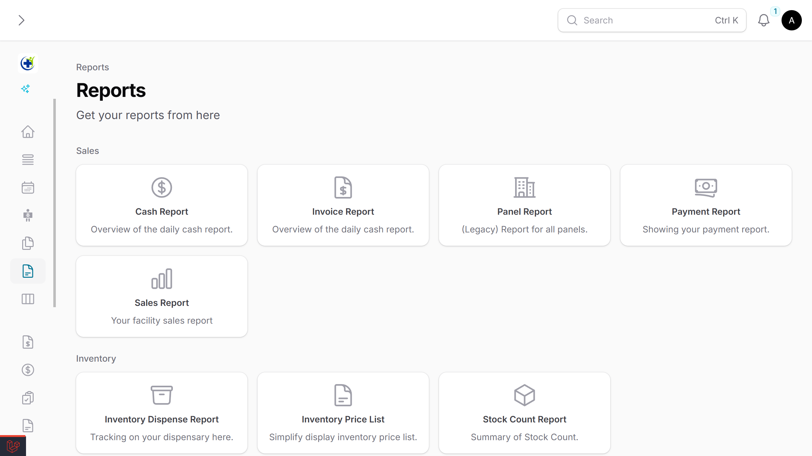

# Filament Cards

A Filament-native plugin that turns your pages and resources into a card-based navigation hub. Built to feel like it belongs in Filament's core -- uses the same API patterns (`label`, `schema`, `columnSpan`, `visible`/`hidden`) and integrates natively with Clusters and Resources.

**Best used as a Cluster or Resource front page** that auto-discovers child pages and resources, respecting Filament's existing navigation configuration. Also works standalone as a general-purpose settings hub.

## Screenshot



## Documentation

### Index

- [Requirements](#requirements)
- [Installation](#installation)
  - [Theme Setup](#theme-setup)
- [Quick Start (Manual Cards)](#quick-start-manual-cards)
- [Use Case: Cluster Front Page (Primary)](#use-case-cluster-front-page-primary)
  - [`discoverClusterCards()`](#discoverclustercards)
  - [Hiding Auto-Discovered Cards](#hiding-auto-discovered-cards)
  - [Grouping Auto-Discovered Cards](#grouping-auto-discovered-cards)
  - [Mixing Auto-Discovered and Manual Cards](#mixing-auto-discovered-and-manual-cards)
- [Use Case: Resource Hub](#use-case-resource-hub)
- [Use Case: Standalone Page](#use-case-standalone-page)
- [API Reference: CardItem](#api-reference-carditem)
- [API Reference: CardGroup](#api-reference-cardgroup)
- [API Reference: CardsPage Configuration](#api-reference-cardspage-configuration)
- [Advanced: Dynamic Registration](#advanced-dynamic-registration)
- [Full Example (Putting It All Together)](#full-example-putting-it-all-together)
- [Optional: Filament Plugin Registration](#optional-filament-plugin-registration)
- [License](#license)

### Feature Overview

- **Auto-discovery** for Cluster and Resource pages with built-in authorization checks.
- **Filament-native API** (`label`, `description`, `schema`, `visible`, `hidden`, etc.).
- **Grouping and layout controls** via `CardGroup`, columns, spans, compact mode, and collapse behavior.
- **Flexible visibility** using component-level methods/properties or page-level include/exclude hooks.
- **Manual + discovered cards together** so you can combine internal routes and external links.
- **Dynamic registration** for modular apps and package-driven extension points.

## Requirements

- PHP 8.2+
- Laravel 11+
- Filament v4 or v5

## Installation

Install via Composer:

```bash
composer require harvirsidhu/filament-cards
```

### Theme Setup

Since the plugin uses Tailwind CSS classes, add the plugin's views to your theme.

**For Filament v4.x / v5.x**, add this line to your `theme.css`:

```css
@source '../../../../vendor/harvirsidhu/filament-cards/resources/views';
```

Then rebuild your assets:

```bash
npm run build
```

## Quick Start (Manual Cards)

The simplest possible cards page in 10 lines:

```php
namespace App\Filament\Pages;

use Harvirsidhu\FilamentCards\Filament\Pages\CardsPage;
use Harvirsidhu\FilamentCards\CardItem;

class ControlPanel extends CardsPage
{
    protected static ?string $navigationIcon = 'heroicon-o-squares-2x2';

    protected static function getCards(): array
    {
        return [
            CardItem::make(CompanySettings::class),
            CardItem::make(BillingSettings::class),
        ];
    }
}
```

## Use Case: Cluster Front Page (Primary)

The most powerful way to use this plugin is as the **front page of a Cluster**. Auto-discovery reads all pages and resources in the cluster and creates cards automatically.

### Step 1: Define the Cluster

```php
namespace App\Filament\Clusters;

use Filament\Clusters\Cluster;

class Settings extends Cluster
{
    protected static ?string $navigationIcon = 'heroicon-o-cog-8-tooth';
}
```

### Step 2: Create the CardsPage

```php
namespace App\Filament\Clusters\Settings\Pages;

use App\Filament\Clusters\Settings;
use Harvirsidhu\FilamentCards\Filament\Pages\CardsPage;

class SettingsHub extends CardsPage
{
    protected static ?string $cluster = Settings::class;
    protected static ?int $navigationSort = -1;

    protected static function getCards(): array
    {
        return static::discoverClusterCards();
    }
}
```

### Step 3: Your Cluster Pages Work as Normal

No extra traits or changes needed on any of your pages.

To add a description to the card, simply add a `$navigationDescription` property to your page class:

```php
namespace App\Filament\Clusters\Settings\Pages;

use Filament\Pages\Page;
use App\Filament\Clusters\Settings;

class CompanySettings extends Page
{
    protected static ?string $cluster = Settings::class;
    protected static ?string $navigationIcon = 'heroicon-o-building-office';

    // Optional: Add a description to the card
    public static ?string $navigationDescription = 'Manage company name, address, and branding.';
}
```

**Breadcrumbs work automatically:** `Dashboard > Settings > Company Settings`. Filament's cluster breadcrumb system handles everything -- no custom traits needed.

### `discoverClusterCards()`

1. Reads all pages and resources registered to the Cluster
2. Excludes the CardsPage itself
3. Checks `canAccess()` on each component (respects authorization)
4. Checks cards visibility via `showInFilamentCards()` or `$showInFilamentCards` (if defined on the component), otherwise falls back to `shouldRegisterNavigation()`
5. Uses each page's `$navigationLabel`, `$navigationIcon`, and URL
6. **New:** Checks for `$navigationDescription` property (or `getNavigationDescription()` method) on the page class
7. Groups cards by `getFilamentCardsGroup()` / `$filamentCardsGroup` (if defined), otherwise falls back to `$navigationGroup`
8. Sorts by `$navigationSort`

### Hiding Auto-Discovered Cards

You can hide a Page/Resource from auto-discovery in two ways.

#### 1) On the Page/Resource itself (recommended)

```php
class InternalToolsPage extends Page
{
    public static function showInFilamentCards(): bool
    {
        return false;
    }
}
```

Or with a static property:

```php
class AuditLogsResource extends Resource
{
    public static bool $showInFilamentCards = false;
}
```

To force-show a component in cards even if `shouldRegisterNavigation()` is `false`:

```php
class HiddenFromSidebarPage extends Page
{
    public static function shouldRegisterNavigation(): bool
    {
        return false;
    }

    public static function showInFilamentCards(): bool
    {
        return true;
    }
}
```

#### 2) On the CardsPage (central control)

```php
class SettingsHub extends CardsPage
{
    protected static array $excludedClusterComponents = [
        AuditLogsResource::class,
        InternalToolsPage::class,
    ];
}
```

### Grouping Auto-Discovered Cards

By default, discovered cards use each component's navigation group (`getNavigationGroup()` / `$navigationGroup`).

If you want a different group just for cards, define it on the Page/Resource:

```php
class CompanySettings extends Page
{
    public static function getFilamentCardsGroup(): ?string
    {
        return 'Business Settings';
    }
}
```

Or with a static property:

```php
class BillingResource extends Resource
{
    public static ?string $filamentCardsGroup = 'Finance';
}
```

### Mixing Auto-Discovered and Manual Cards

```php
protected static function getCards(): array
{
    return [
        ...static::discoverClusterCards(),

        CardGroup::make('External Links')
            ->schema([
                CardItem::make('https://docs.example.com')
                    ->label('Documentation')
                    ->icon('heroicon-o-book-open')
                    ->openUrlInNewTab(),
            ]),
    ];
}
```

## Use Case: Resource Hub

When a Resource has many custom pages, use `discoverResourceCards()` to auto-create cards for each:

```php
namespace App\Filament\Resources\UserResource\Pages;

use App\Filament\Resources\UserResource;
use Harvirsidhu\FilamentCards\Filament\Pages\CardsPage;

class UserSettingsHub extends CardsPage
{
    protected static string $resource = UserResource::class;

    protected static function getCards(): array
    {
        return static::discoverResourceCards();
    }
}
```

## Use Case: Standalone Page

Without a Cluster or Resource, define cards manually:

```php
use Harvirsidhu\FilamentCards\CardItem;
use Harvirsidhu\FilamentCards\CardGroup;
use Harvirsidhu\FilamentCards\Filament\Pages\CardsPage;

class ControlPanel extends CardsPage
{
    protected static ?string $navigationIcon = 'heroicon-o-squares-2x2';

    protected static function getCards(): array
    {
        return [
            CardGroup::make('General')
                ->icon('heroicon-o-cog')
                ->description('Core settings')
                ->schema([
                    CardItem::make(CompanySettings::class)->color('primary'),
                    CardItem::make(BillingSettings::class)->color('success'),
                ]),

            CardItem::make('/external/docs')
                ->label('Documentation')
                ->icon('heroicon-o-document-text')
                ->openUrlInNewTab(),
        ];
    }
}
```

## API Reference: CardItem

### Creating a Card Item

Pass a Filament Page class, Resource class, or a URL string:

```php
CardItem::make(CompanySettings::class)  // Filament Page
CardItem::make(UserResource::class)     // Filament Resource
CardItem::make('/custom/path')          // URL string
CardItem::make('https://example.com')   // External URL
```

When a Page or Resource class is passed, the card automatically resolves its `label`, `icon`, and `url` from the class's navigation properties.

### `label()`

Override the card title. Accepts a string or Closure:

```php
CardItem::make(CompanySettings::class)
    ->label('Company')

CardItem::make(CompanySettings::class)
    ->label(fn () => __('settings.company'))
```

### `description()`

Add a subtitle below the card title:

```php
CardItem::make(CompanySettings::class)
    ->description('Manage company name, address, and branding')
```

**Auto-Discovery:** If you are using `discoverClusterCards()` or `discoverResourceCards()`, you can add a static property to your page class instead:

```php
class CompanySettings extends Page
{
    public static ?string $navigationDescription = 'Manage company details.';
}
```

### `icon()`

Override the card icon:

```php
CardItem::make('/path')
    ->icon('heroicon-o-building-office')
```

### `url()` and `openUrlInNewTab()`

Override the URL or open in a new tab:

```php
CardItem::make(CompanySettings::class)
    ->url('https://custom-url.com')
    ->openUrlInNewTab()
```

### `alignment()`

Control the text alignment of the card content. Options: `Start`, `Center`, `End`, `Justify`:

```php
use Filament\Support\Enums\Alignment;

CardItem::make(CompanySettings::class)
    ->alignment(Alignment::Center)
```

### `visible()` and `hidden()`

Control card visibility. Accepts a boolean or Closure:

```php
CardItem::make(BillingSettings::class)
    ->visible(fn () => auth()->user()->can('manage-billing'))

CardItem::make(DangerZone::class)
    ->hidden(fn () => ! auth()->user()->isAdmin())
```

### `color()`

Add a color accent to the card. Supports Filament's color system:

```php
CardItem::make(CompanySettings::class)->color('primary')
CardItem::make(BillingSettings::class)->color('success')
CardItem::make(DangerZone::class)->color('danger')
CardItem::make(Notifications::class)->color('warning')
CardItem::make(ApiSettings::class)->color('info')
CardItem::make(LegacySettings::class)->color('gray')
```

Available colors: `primary`, `success`, `danger`, `warning`, `info`, `gray`.

### `disabled()`

Show the card but make it non-clickable with reduced opacity:

```php
CardItem::make(DangerZone::class)
    ->disabled(fn () => ! auth()->user()->isAdmin())
```

### `sort()`

Control the order of cards within a group:

```php
CardItem::make(CompanySettings::class)->sort(1)
CardItem::make(BillingSettings::class)->sort(2)
CardItem::make(NotificationPrefs::class)->sort(3)
```

### `columnSpan()` and `columnSpanFull()`

Control how many grid columns a card occupies:

```php
// Span 2 columns
CardItem::make(CompanySettings::class)->columnSpan(2)

// Span the full width
CardItem::make(NotificationPrefs::class)->columnSpanFull()

// Responsive spans
CardItem::make(CompanySettings::class)->columnSpan([
    'default' => 1,
    'md' => 2,
    'lg' => 3,
])
```

### `extraAttributes()`

Add custom HTML attributes to the card element:

```php
CardItem::make(CompanySettings::class)
    ->extraAttributes([
        'data-analytics' => 'company-settings',
        'id' => 'company-card',
    ])
```

## API Reference: CardGroup

Groups organize cards under a collapsible header, similar to Filament's `Section`.

### Creating a Group

```php
use Harvirsidhu\FilamentCards\CardGroup;

CardGroup::make('General Settings')
    ->schema([
        CardItem::make(CompanySettings::class),
        CardItem::make(BillingSettings::class),
    ])
```

### `schema()`

Define the card items in the group:

```php
CardGroup::make('General')
    ->schema([
        CardItem::make(CompanySettings::class),
        CardItem::make(BillingSettings::class),
    ])
```

### `columns()`

Override the grid columns for this specific group.
You can use a single integer, or a responsive array (same style as Filament widgets):

```php
CardGroup::make('Wide Cards')
    ->columns(2)
    ->schema([...])

CardGroup::make('Wide Cards')
    ->columns([
        'md' => 2,
        'xl' => 4,
    ])
    ->schema([...])
```

### `collapsible()` and `collapsed()`

Make the group collapsible, optionally starting collapsed:

```php
CardGroup::make('Advanced')
    ->collapsible()
    ->schema([...])

CardGroup::make('Advanced')
    ->collapsed() // Starts collapsed, implicitly collapsible
    ->schema([...])

CardGroup::make('Advanced')
    ->collapsed(fn () => ! auth()->user()->isAdmin())
    ->schema([...])
```

### `compact()`

Reduce padding and gaps for a denser layout:

```php
CardGroup::make('Quick Links')
    ->compact()
    ->schema([...])
```

### `label()`, `description()`, `icon()`

Customize the group header:

```php
CardGroup::make('General')
    ->label('General Settings')
    ->description('Core application configuration')
    ->icon('heroicon-o-cog')
    ->schema([...])
```

### Group-level `visible()` and `hidden()`

Hide an entire group conditionally:

```php
CardGroup::make('Admin Only')
    ->hidden(fn () => ! auth()->user()->isAdmin())
    ->schema([...])
```

## API Reference: CardsPage Configuration

Customize the CardsPage with static properties:

### `$columns`

Default number of grid columns (default: `3`).
Supports Filament widget-style responsive values:

```php
class ControlPanel extends CardsPage
{
    protected static string|int|array $columns = 4;
}

class ControlPanel extends CardsPage
{
    protected static string|int|array $columns = [
        'md' => 2,
        'xl' => 4,
    ];
}
```

### `$itemsAlignment`

Alignment of card content. Options: `Start`, `Center`, `End`, `Justify` (default: `Center`):

```php
use Filament\Support\Enums\Alignment;

class ControlPanel extends CardsPage
{
    protected static Alignment $itemsAlignment = Alignment::Center;
}
```

### `$iconSize`

Size of card icons. Options: `Small`, `Medium`, `Large` (default: `Medium`):

```php
use Filament\Support\Enums\IconSize;

class ControlPanel extends CardsPage
{
    protected static IconSize $iconSize = IconSize::Small;
}
```

### `$iconInlined`

Display the icon inline with the title instead of stacked above it:

```php
class ControlPanel extends CardsPage
{
    protected static bool $iconInlined = true;
}
```

### `$iconPosition`

Controls whether the icon appears before or after the label. Options: `Before`, `After` (default: `Before`):

```php
use Filament\Support\Enums\IconPosition;

class ControlPanel extends CardsPage
{
    protected static IconPosition $iconPosition = IconPosition::After;
}
```

### `$excludedClusterComponents`

Exclude specific Cluster pages/resources from `discoverClusterCards()`:

```php
class SettingsHub extends CardsPage
{
    protected static array $excludedClusterComponents = [
        AuditLogsResource::class,
        InternalToolsPage::class,
    ];
}
```

### `$excludedResourcePages`

Exclude specific Resource pages from `discoverResourceCards()`:

```php
class UserSettingsHub extends CardsPage
{
    protected static array $excludedResourcePages = [
        UserResource\Pages\DangerZone::class,
    ];
}
```

### `shouldIncludeDiscoveredCard()`

Override this hook for advanced, centralized filtering:

```php
protected static function shouldIncludeDiscoveredCard(string $component): bool
{
    if (! parent::shouldIncludeDiscoveredCard($component)) {
        return false;
    }

    return $component !== BetaFeaturePage::class;
}
```

## Advanced: Dynamic Registration

Add cards to a CardsPage from outside the class -- useful for modular applications or packages:

```php
use App\Filament\Pages\ControlPanel;
use Harvirsidhu\FilamentCards\CardItem;

// In a service provider boot() method:
ControlPanel::addCards([
    CardItem::make(UserManagement::class)
        ->label('User Accounts')
        ->icon('heroicon-o-users')
        ->description('Manage roles, permissions, and user accounts'),
]);
```

## Full Example (Putting It All Together)

```php
use Harvirsidhu\FilamentCards\CardItem;
use Harvirsidhu\FilamentCards\CardGroup;
use Harvirsidhu\FilamentCards\Filament\Pages\CardsPage;
use Filament\Support\Enums\Alignment;
use Filament\Support\Enums\IconPosition;
use Filament\Support\Enums\IconSize;

class SettingsHub extends CardsPage
{
    protected static ?string $navigationIcon = 'heroicon-o-cog-8-tooth';
    protected static int $columns = 3;
    protected static Alignment $itemsAlignment = Alignment::Center;
    protected static IconSize $iconSize = IconSize::Medium;
    protected static IconPosition $iconPosition = IconPosition::Before;

    protected static function getCards(): array
    {
        return [
            CardGroup::make('General')
                ->icon('heroicon-o-cog')
                ->description('Core application settings')
                ->collapsible()
                ->schema([
                    CardItem::make(CompanySettings::class)
                        ->color('primary'),

                    CardItem::make(BillingSettings::class)
                        ->visible(fn () => auth()->user()->can('manage-billing'))
                        ->color('success')
                        ->sort(2),

                    CardItem::make(NotificationPrefs::class)
                        ->description('Email, SMS & push notification preferences')
                        ->columnSpanFull(),
                ]),

            CardGroup::make('Danger Zone')
                ->icon('heroicon-o-exclamation-triangle')
                ->collapsed()
                ->columns(2)
                ->schema([
                    CardItem::make(DangerZone::class)
                        ->color('danger')
                        ->disabled(fn () => ! auth()->user()->isAdmin()),
                ]),

            CardItem::make('https://docs.example.com')
                ->label('Documentation')
                ->icon('heroicon-o-book-open')
                ->openUrlInNewTab()
                ->extraAttributes(['data-track' => 'docs']),
        ];
    }
}
```

## Optional: Filament Plugin Registration

Optionally register the plugin in your panel provider:

```php
use Harvirsidhu\FilamentCards\FilamentCardsPlugin;

public function panel(Panel $panel): Panel
{
    return $panel
        ->plugins([
            FilamentCardsPlugin::make(),
        ]);
}
```

## License

The MIT License (MIT). Please see [License File](LICENSE.md) for more information.
